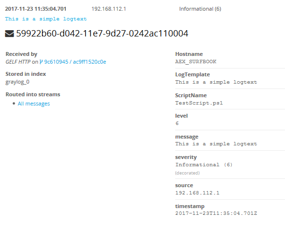
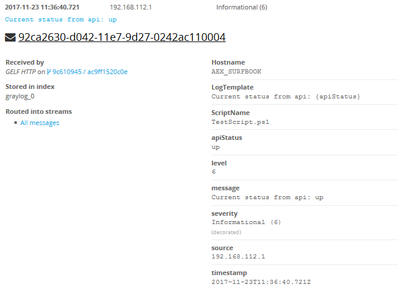
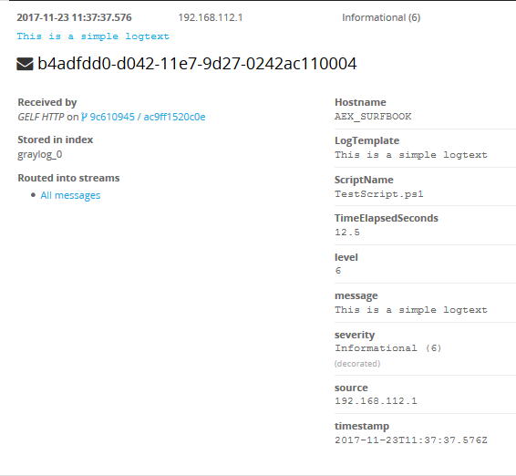
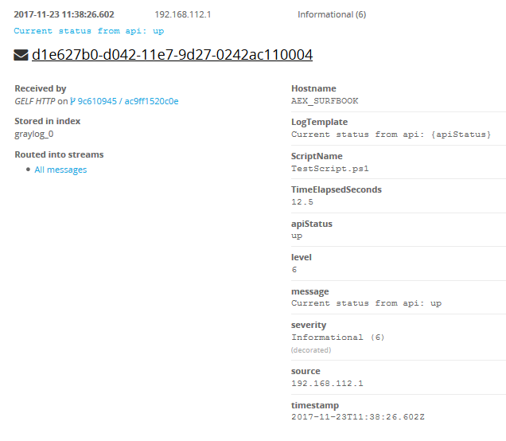

# Posh-GraylogLogger
Powershell Modul for logging your script logs into GrayLog via GELF. (HTTP only at this point)

## Description
this repository contains a powershell module for writting log entries into graylog via gelf http (tcp/udp work in progress). following features are implemented:
- simple text logging
- structured logging

## TODO's

- [x] global logging properties
- [x] glogal logging properties as hashtable
- [x] http gelf support
- [x] basic logging and structured logging
- [x] additional log properties per request
- [ ] add tcp and udp support

more to come...
 
## Functions

### New-GLServerConnection
Creates connection to graylog server

Parameter | Mandatory | Type | DefaultValue | Description
--------- | --------- | ---- | ------------ | -----------
Server | true | string | - | servername or ip
Port | true | int | - | port of your gelf http endpoint
Endpiont | false | string | gelf | your endpoint name (text behind :Port/...)


### Add-GLGlobalLogProperty
Adding a global logging property which will be appended on each log entry

Parameter | Mandatory | Type | DefaultValue | Description
--------- | --------- | ---- | ------------ | -----------
PropertyName | true | string | - | name of the property 
PropertyValue | true | object | - | value of the property (will be converted to string value)

### Add-GLGlobalLogProperties
Adding multiple global logging properties which will be appended on each log entry

Parameter | Mandatory | Type | DefaultValue | Description
--------- | --------- | ---- | ------------ | -----------
Properties | true | hashtable | - | hashtable with properties

### Write-GLLog
Creates a log entry and writes it into graylog

Parameter | Mandatory | Type | DefaultValue | Description
--------- | --------- | ---- | ------------ | -----------
LogLevel | true | GLLogLevel | - | loglevel of current entry
LogText | true | string | - | logtext (simple or structured)
PropertyValues | false | object | - | if Logtext is structured you have to provide the properties to replace the placeholders
AdditionalProperties | true | object | - | additional properties which will be indexed into graylog but not shown in the logtext (scope logentry only) Hashtable

> you can also add custom objects to the PropertyValues and AdditionalProperties. PSGraylogLogger will try to convert these to json and adds these values to the logtext or as additional property


## Examples

**import the module**
```powershell
Import-Module PSGrayLogLogger
```

**set connection to graylog server**
```powershell
New-GLServerConnection -Server <SERVERNAME or IP> -Port <GELF Port> -Endpoint <Endpointname (Default 'gelf')>
```

**add global log properties to context. these properties will be added to each log entry you will fire up**
```powershell
Add-GLGlobalLogProperty -PropertyName "ScriptName" -PropertyValue "TestScript.ps1"
```
this will add a property called **ScriptName** with value **TestScript.ps1** to every log entry you will create

**add multiple global log properties to context. these properties will be added to each log entry you will fire up**
```powershell
Add-GLGlobalLogProperties -Properties @{PropertyOne = "Hello"; PropertyTwo = "World"}
```
this will add a two properties called **PropertyOne/PropertyTwo** with values **Hello/World** to every log entry you will create

**create simple log entry**
```powershell
Write-GLLog -LogLevel Information -LogText "This is a simple logtext" 
```
### Screenshot


**create a structured log entry**
```powershell
Write-GLLog -LogLevel Information -LogText "Current status from api: {apiStatus}" -PropertyValues @('up')
```
this produces a log with logtext: *"Current status from api: up"* and adds a property to graylog called **apiStatus** with value **up**
### Screenshot


**create a structured log with simple logtext and additional properties**
```powershell
Write-GLLog -LogLevel Information -LogText "This is a simple logtext" -AdditionalProperties @{TimeElapsedSeconds = 12.5}
```
this produces a log with logtext: *"This is a simple logtext"* and adds a property to graylog called **TimeElapsedSeconds** with value **12.5**
### Screenshot


**create a structured log with  and additional properties**
```powershell
Write-GLLog -LogLevel Information "Current status from api: {apiStatus}" -PropertyValues @('up') -AdditionalProperties @{TimeElapsedSeconds = 12.5}
```
this produces a log with logtext: *"Current status from api: up"* and adds a two properties to graylog called **apiStatus** with value **up** and **TimeElapsedSeconds** with value **12.5**
### Screenshot



